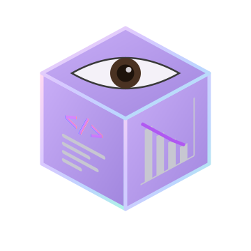

<div align="center">
  
  <h1>Cesvi - The Visual Story of Computation</h1>
  <p><em>A visual storytelling platform that explains invisible computer processes.</em></p>
</div>

<br/>

**Cesvi** is an interactive, story-driven educational platform designed to make computer architecture, networks, and software engineering concepts intuitive and engaging. Our philosophy: *Animation first, explanation second, terminology last*. Think of it as a blend of 3Blue1Brown, Kurzgesagt, and Brilliant — but fully interactive and readable by someone who has never written a line of code.

> Cesvi is **not** a static documentation site. It is a collection of guided, interactive journeys through real computational systems.

## 🚀 The Journeys

Cesvi breaks down complex computer science topics into digestible, visual stories. From the execution of a simple program inside the CPU to the intricate journey of a Web Request across the internet, each chapter focuses on revealing the invisible mechanics of technology.

## 🛠️ Getting Started

To run the Cesvi platform locally and explore the interactive chapters:

```bash
# Install dependencies
npm install

# Start the development server
npm run dev
```